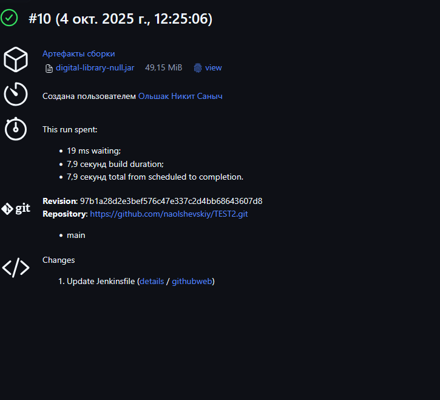

Мультибренч
Вывод консоли из web-jenkins 
```
Scheduling project: webbooks-deploy
[Pipeline] }
[Pipeline] // script
[Pipeline] }
[Pipeline] // withEnv
[Pipeline] }
[Pipeline] // stage
[Pipeline] }
[Pipeline] // withEnv
[Pipeline] }
[Pipeline] // withEnv
[Pipeline] }
[Pipeline] // node
[Pipeline] End of Pipeline

GitHub has been notified of this commit’s build result

Finished: SUCCESS
```



