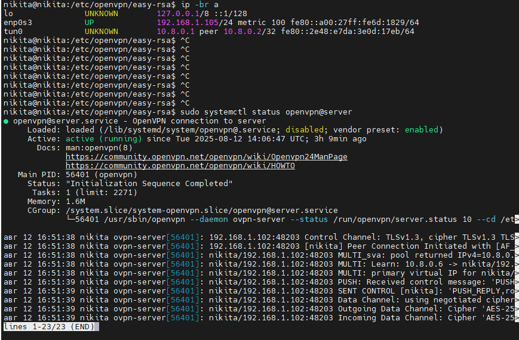

 ## НА сервере 

 ```
nikita@nikita:/etc/openvpn$ ls
ca.crt  crl.pem  easy-rsa  server.conf  server.key  update-resolv-conf
client  dh.pem   server    server.crt   ta.key

 ```

 ## /etc/openvpn/server.conf
 
 ```
port 1194
proto udp
dev tun
ca ca.crt
cert server.crt
key server.key
dh dh.pem
server 10.8.0.0 255.255.255.0
ifconfig-pool-persist /var/log/openvpn/ipp.txt
push "redirect-gateway def1 bypass-dhcp"
push "dhcp-option DNS 8.8.8.8"
push "dhcp-option DNS 8.8.8.8"
keepalive 10 120
tls-auth ta.key 0
cipher AES-256-CBC
persist-key
persist-tun
status /var/log/openvpn/openvpn-status.log
verb 3
explicit-exit-notify 1
 ```

 
-----------
------------

# На клиенте 
```
client
dev tun
proto udp
remote 192.168.1.105 1194
resolv-retry infinite
nobind
persist-key
persist-tun
ca ca.crt
cert nikita.crt
key nikita.key
remote-cert-tls server
tls-auth ta.key 1
cipher AES-256-CBC
verb 3
```


