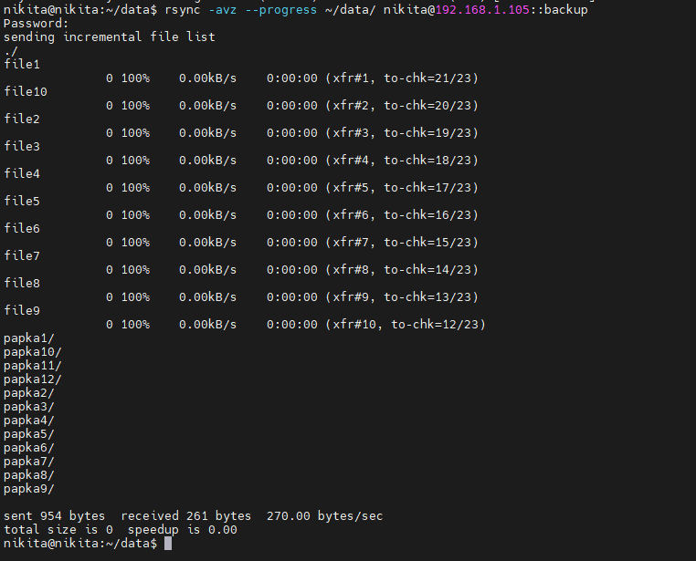

/etc/systemd/system/rsyncd.service
```[Unit]
Description=rsync daemon
After=network.target

[Service]
ExecStart=/usr/bin/rsync --daemon --config=/etc/rsyncd.conf --no-detach
Restart=always

[Install]
WantedBy=multi-user.target
```


/etc/rsyncd.conf
```uid = nikita
gid = nikita
use chroot = no
max connections = 5
pid file = /var/run/rsyncd.pid
lock file = /var/run/rsync.lock
log file = /var/log/rsync.log

[backup]
    path = /home/nikita/backup
    comment = Backup directory
    read only = no
    list = yes
    auth users = rsyncuser
    secrets file = /etc/rsyncd.secrets
    hosts allow = 192.168.1.102
```


# На клиенте 
Команда выполнилась успешно и все файлы переданы



на сервере после передачи файлов с клиента 

