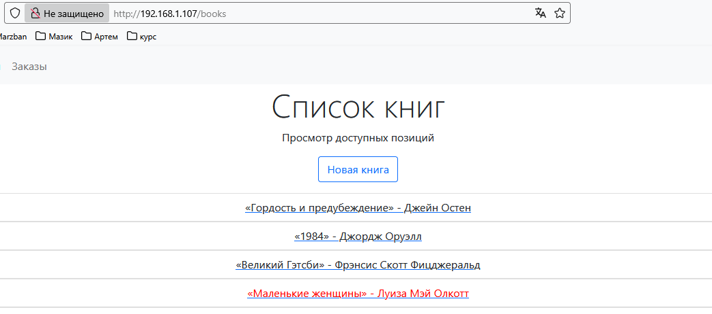
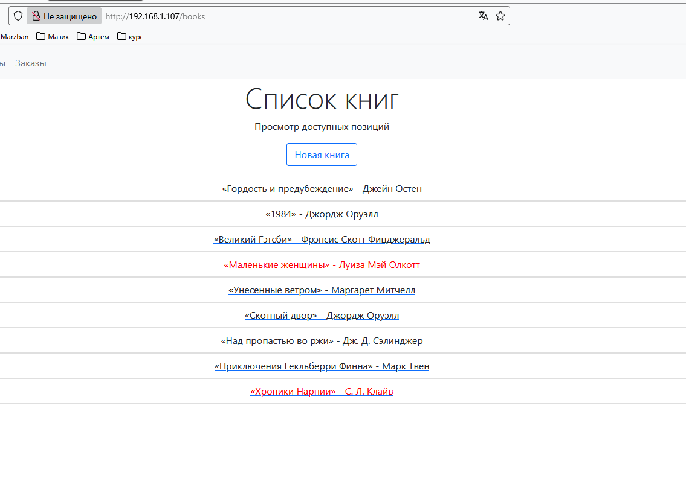
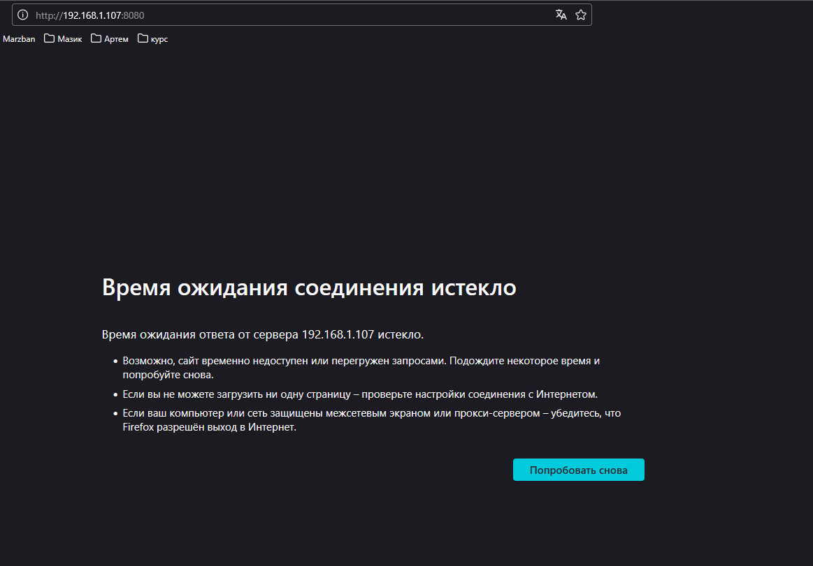

## Конфигурация для проксирования 

## /etc/nginx/sites-available/webbooks
```
server {
    listen 80;
    server_name 192.168.1.107;

    location / {
        proxy_pass http://127.0.0.1:8080;
        proxy_set_header Host $host;
        proxy_set_header X-Real-IP $remote_addr;
        proxy_set_header X-Forwarded-For $proxy_add_x_forwarded_for;
        proxy_set_header X-Forwarded-Proto $scheme;
        proxy_set_header X-Forwarded-Proto $scheme;
        proxy_set_header X-Forwarded-Port $server_port;


    }
}
```

----------------------------------


# Настроил UFW

## ufw.sh
```
#!/bin/bash
sudo ufw enable
sudo ufw allow 'Nginx Full'
sudo ufw allow from 127.0.0.1 to any port 8080
sudo ufw deny 8080
echo "Настройка UFW завершена"
```


