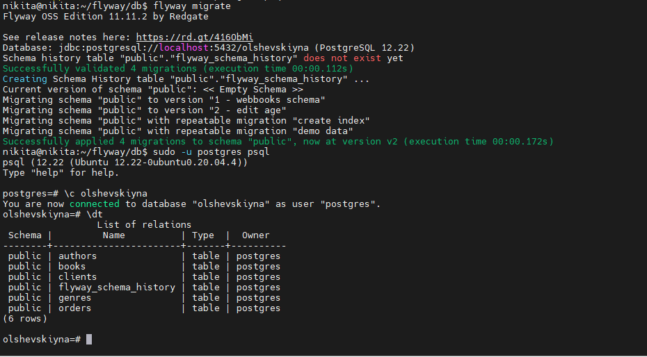

# Конфиг файлы
```## Конфиг файл FLYWAY
# More information on the parameters can be found here: https://documentation.red-gate.com/flyway/reference/configuration

[environments.local]
url = "jdbc:postgresql://localhost:5432/olshevskiyna"
user = "postgres"
password = "123"
# driver =`
# schemas =
# connectRetries =
# connectRetriesInterval =
# initSql =
# jdbcProperties =
# resolvers =

[flyway]
environment = "local"
locations = ["filesystem:/home/nikita/flyway/db"]
# jarDirs = ["path/to/java/migrations"]

# [environments.build]
# url = "jdbc:sqlite::memory:"
# user = "buildUser"
# password = "buildPassword"

# [flyway.check]
# buildEnvironment = "build"
```
## Скрипт по созданию структуры БД
```
-- V1__webbooks_schema.sql

CREATE TABLE genres (
    id INT PRIMARY KEY GENERATED ALWAYS AS IDENTITY,
    name VARCHAR NOT NULL UNIQUE
);

CREATE TABLE authors (
    id INT PRIMARY KEY GENERATED ALWAYS AS IDENTITY,
    name VARCHAR NOT NULL UNIQUE,
    dateOfBirth VARCHAR NOT NULL,
    dateOfDeath VARCHAR,
    description VARCHAR
);

CREATE TABLE books (
    id INT PRIMARY KEY GENERATED ALWAYS AS IDENTITY,
    name VARCHAR NOT NULL UNIQUE,
    genre_id INT NOT NULL REFERENCES genres(id) ON DELETE CASCADE,
    author_id INT NOT NULL REFERENCES authors(id) ON DELETE CASCADE,
    status VARCHAR NOT NULL,
    year INT NOT NULL CHECK (year > 0 AND year < 2050),
    description VARCHAR
);

CREATE TABLE clients (
    id INT PRIMARY KEY GENERATED ALWAYS AS IDENTITY,
    name VARCHAR NOT NULL UNIQUE,
    age INT NOT NULL CHECK (age > 0 AND age < 111),
    email VARCHAR NOT NULL UNIQUE,
    sex VARCHAR NOT NULL,
    phoneNumber VARCHAR UNIQUE NOT NULL,
    deliveryAddress VARCHAR,
    description VARCHAR,
    favoriteGenre VARCHAR
);

CREATE TABLE orders (
    id INT PRIMARY KEY GENERATED ALWAYS AS IDENTITY,
    client_id INT NOT NULL REFERENCES clients(id) ON DELETE CASCADE,
    book_id INT NOT NULL UNIQUE REFERENCES books(id) ON DELETE CASCADE
);
```

## Скрипт по изменения возраста 
```
-- V2__edit_age.sql

ALTER TABLE clients
DROP CONSTRAINT IF EXISTS clients_age_check;

ALTER TABLE clients
ADD CONSTRAINT clients_age_check CHECK (age > 0 AND age < 151);
```
## Скрипт по наполнению таблицы
```
-- R__demo_data.sql

TRUNCATE TABLE orders, books, clients, authors, genres RESTART IDENTITY CASCADE;

INSERT INTO genres (name) VALUES
    ('Роман'),
    ('Антиутопия'),
    ('Драма'),
    ('Сатира'),
    ('Фэнтези'),
    ('Ужасы'),
    ('Комедия');

INSERT INTO authors (name, dateOfBirth, dateOfDeath, description) VALUES
    ('Джейн Остен', '1939', '1945', 'Информация о писателе.Информация о писателе.Информация о писателе.Информация о писателе.'),
    ('Джордж Оруэлл', '1939', '1945', ''),
    ('Фрэнсис Скотт Фицджеральд', '1939', '1945', 'Информация о писателе.Информация о писателе.Информация о писателе.Информация о писателе.'),
    ('Луиза Мэй Олкотт', '1939', '1945', ''),
    ('Маргарет Митчелл', '1939', '', ''),
    ('Дж. Д. Сэлинджер', '1939', '', 'Информация о писателе.Информация о писателе.Информация о писателе.Информация о писателе.'),
    ('Марк Твен', '1939', '1945', ''),
    ('С. Л. Клайв', '1939', '', '');

INSERT INTO books (name, genre_id, author_id, year, description, status) VALUES
    ('Гордость и предубеждение', (SELECT id FROM genres WHERE name = 'Роман'), (SELECT id FROM authors WHERE name = 'Джейн Остен'), 1813, '', 'Свободна'),
    ('1984', (SELECT id FROM genres WHERE name = 'Антиутопия'), (SELECT id FROM authors WHERE name = 'Джордж Оруэлл'), 1948, '', 'Свободна'),
    ('Великий Гэтсби', (SELECT id FROM genres WHERE name = 'Драма'), (SELECT id FROM authors WHERE name = 'Фрэнсис Скотт Фицджеральд'), 1926, '', 'Свободна'),
    ('Маленькие женщины', (SELECT id FROM genres WHERE name = 'Драма'), (SELECT id FROM authors WHERE name = 'Луиза Мэй Олкотт'), 1868, '', 'Взята'),
    ('Унесенные ветром', (SELECT id FROM genres WHERE name = 'Драма'), (SELECT id FROM authors WHERE name = 'Маргарет Митчелл'), 1936, '', 'Свободна'),
    ('Скотный двор', (SELECT id FROM genres WHERE name = 'Сатира'), (SELECT id FROM authors WHERE name = 'Джордж Оруэлл'), 1945, '', 'Свободна'),
    ('Над пропастью во ржи', (SELECT id FROM genres WHERE name = 'Роман'), (SELECT id FROM authors WHERE name = 'Дж. Д. Сэлинджер'), 1951, '', 'Свободна'),
    ('Приключения Гекльберри Финна', (SELECT id FROM genres WHERE name = 'Роман'), (SELECT id FROM authors WHERE name = 'Марк Твен'), 1884, '', 'Свободна'),
    ('Хроники Нарнии', (SELECT id FROM genres WHERE name = 'Фэнтези'), (SELECT id FROM authors WHERE name = 'С. Л. Клайв'), 1950, '', 'Взята');

INSERT INTO clients (name, age, email, sex, phoneNumber, favoriteGenre, description) VALUES
    ('Березнев Никита', 20, 'bernikcooldude@yandex.ru', 'Мужчина', '89031111112', '-', '-'),
    ('Дин Норрис', 34, 'dnorris@yandex.ru', 'Мужчина', '89031111114', '-', '-'),
    ('Мишель Томпсон', 16, 'mthompson@yandex.ru', 'Женщина', '89031111115', '-', '-'),
    ('Дженнифер Лоуренз', 16, 'jlawrense@gmail.ru', 'Женщина', '89031111611', '-', '-'),
    ('Скарлетт Йохансон', 16, 'scarlet@gmail.ru', 'Женщина', '89031111117', '-', '-'),
    ('Крис Эванс', 35, 'kevans@gmail.ru', 'Мужчина', '89031111811', '-', '-'),
    ('Хью Джекман', 20, 'hughy@gmail.ru', 'Мужчина', '89031111511', '-', '-'),
    ('Мэтью Макконахи', 20, 'mattewmc@mail.ru', 'Мужчина', '89231111111', '-', '-');

INSERT INTO orders (client_id, book_id) VALUES
    ((SELECT id FROM clients WHERE name = 'Хью Джекман'), (SELECT id FROM books WHERE name = 'Маленькие женщины')),
    ((SELECT id FROM clients WHERE name = 'Хью Джекман'), (SELECT id FROM books WHERE name = 'Хроники Нарнии'));
nikita@nikita:~/flyway/db$
```


## Скрипт по созданию индекса 
```
-- R__create_index

CREATE INDEX IF NOT EXISTS idx_books_name_upper ON books(UPPER(name));
```

## Успешное выполнение 
