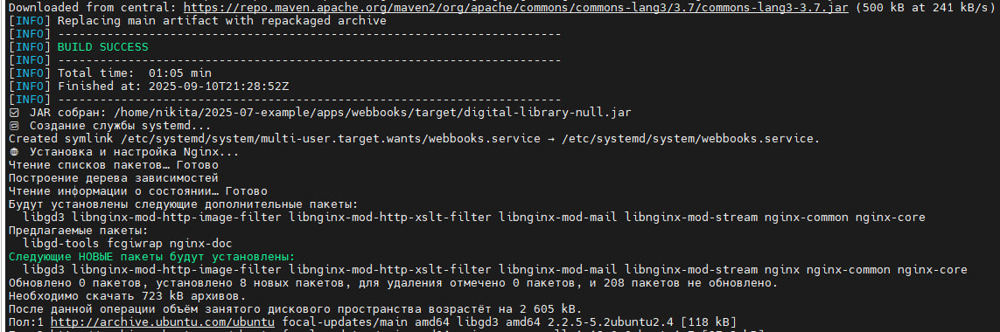
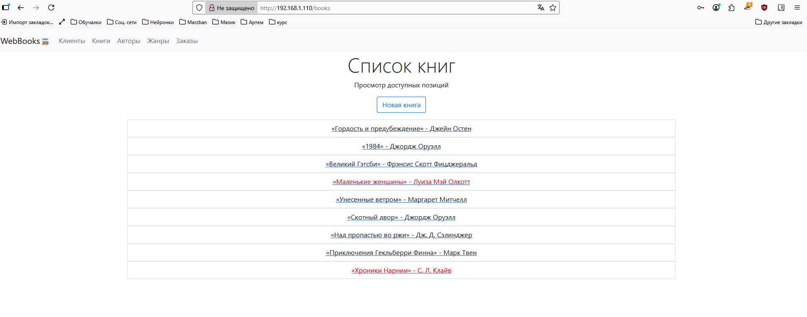

## Файл deploy.sh 

```deploy.sh
#!/bin/bash

set -e

echo "Начинаем развёртывание WebBooks (Spring Boot) на Ubuntu 20.04..."


APP_NAME="webbooks"
APP_USER="webbooks"
APP_DIR="/home/nikita/2025-07-example/apps/$APP_NAME"
DB_NAME="webbooks_db"
DB_USER="postgres"
DB_PASS="123"
DOMAIN="192.168.1.110"
JAVA_VERSION="17"
PORT=8080


echo "Создание пользователя $APP_USER..."
if ! id "$APP_USER" &>/dev/null; then
    sudo adduser --system --group --shell /bin/bash --home "$APP_DIR" "$APP_USER"
    echo "Пользователь создан."
else
    echo "ℹПользователь уже существует."
fi

sudo chown -R "$APP_USER:$APP_GROUP" "$APP_DIR"

echo " Установка OpenJDK $JAVA_VERSION..."
sudo apt update
sudo apt install -y openjdk-$JAVA_VERSION-jdk

# Проверка
java -version

# === 3. Установка PostgreSQL 12 ===
echo " Установка PostgreSQL 12..."
sudo apt install -y postgresql-12 postgresql-contrib

# Добавляем пароль пользователю postgres
echo " Установка пароля для пользователя postgres..."
sudo -u postgres psql -c "ALTER USER postgres PASSWORD '$DB_PASS';" 2>/dev/null || echo " Пароль уже установлен."

# Настройка прослушивания всех интерфейсов
echo "📡 Настройка PostgreSQL на прослушивание всех интерфейсов..."
sudo sed -i "s/#listen_addresses = 'localhost'/listen_addresses = '*'/g" /etc/postgresql/12/main/postgresql.conf
sudo sed -i "s/listen_addresses = 'localhost'/listen_addresses = '*'/g" /etc/postgresql/12/main/postgresql.conf

# Перезапуск PostgreSQL
sudo systemctl restart postgresql

# Создание базы данных
echo " Создание базы данных $DB_NAME..."
sudo -u postgres psql -c "CREATE DATABASE $DB_NAME;" 2>/dev/null || echo " База данных уже существует."

# Восстановление демо-данных (если файл существует)
DATA_SQL="$APP_DIR/src/main/resources/data.sql"
if [ -f "$DATA_SQL" ]; then
    echo " Восстановление демо-данных из $DATA_SQL..."
    sudo -u postgres psql "$DB_NAME" < "$DATA_SQL"
else
    echo " Файл демо-данных не найден: $DATA_SQL"
fi


echo " Настройка src/main/resources/application.properties..."

PROPS_FILE="$APP_DIR/src/main/resources/application.properties"

cat > "$PROPS_FILE" <<EOF
DB.driver=org.postgresql.Driver
DB.url=jdbc:postgresql://localhost:5432/$DB_NAME
DB.user=$DB_USER
DB.password=$DB_PASS
EOF

sudo chown "$APP_USER:$APP_GROUP" "$PROPS_FILE"


echo " Сборка приложения через Maven Wrapper..."

cd "$APP_DIR"

# Убедимся, что mvnw есть и исполняемый
chmod +x ./mvnw

# Собираем JAR
sudo -u "$APP_USER" ./mvnw clean package -DskipTests

# Проверяем, что JAR создан
JAR_FILE=$(find "$APP_DIR/target" -name "*.jar" | head -n1)
if [ -z "$JAR_FILE" ]; then
    echo " JAR файл не найден. Сборка не удалась."
    exit 1
fi

echo " JAR собран: $JAR_FILE"

# === 6. Создание systemd unit файла ===
echo " Создание службы systemd..."

cat > /tmp/$APP_NAME.service <<EOF
[Unit]
Description=WebBooks Spring Boot Application
After=syslog.target network.target postgresql.service

[Service]
Type=simple
User=$APP_USER
Group=$APP_GROUP
WorkingDirectory=$APP_DIR
ExecStart=/usr/bin/java -jar $JAR_FILE
Restart=always
RestartSec=10
StandardOutput=journal
StandardError=journal
Environment=JAVA_HOME=/usr/lib/jvm/java-$JAVA_VERSION-openjdk-amd64

[Install]
WantedBy=multi-user.target
EOF

sudo cp /tmp/$APP_NAME.service /etc/systemd/system/$APP_NAME.service
sudo systemctl daemon-reload
sudo systemctl enable $APP_NAME.service
sudo systemctl restart $APP_NAME.service

# === 7. Установка и настройка Nginx ===
echo " Установка и настройка Nginx..."

sudo apt install -y nginx

cat > /tmp/nginx-$APP_NAME.conf <<EOF
server {
    listen 80;
    server_name $DOMAIN;

    location / {
        proxy_pass http://localhost:$PORT;
        proxy_set_header Host \$host;
        proxy_set_header X-Real-IP \$remote_addr;
        proxy_set_header X-Forwarded-For \$proxy_add_x_forwarded_for;
        proxy_set_header X-Forwarded-Proto \$scheme;
    }

    # Опционально: если есть статика, раскомментируйте и настройте путь
    # location /static/ {
    #     alias /opt/webbooks/static/;
    # }
}
EOF

sudo cp /tmp/nginx-$APP_NAME.conf /etc/nginx/sites-available/$APP_NAME
sudo ln -sf /etc/nginx/sites-available/$APP_NAME /etc/nginx/sites-enabled/
sudo nginx -t && sudo systemctl reload nginx

# === 8. Фаервол ===
echo " Разрешение HTTP в UFW..."
sudo ufw allow 'Nginx HTTP' 2>/dev/null || echo " UFW не активен или правило уже добавлено."

# === 9. Готово! ===
echo " Развёртывание WebBooks успешно завершено!"
echo " Приложение доступно по адресу: http://$DOMAIN"
echo " Логи приложения: journalctl -u $APP_NAME -f --no-pager"
echo " Статус службы: systemctl status $APP_NAME"
echo " Проверить порт: ss -tnlp | grep :$PORT"

```



